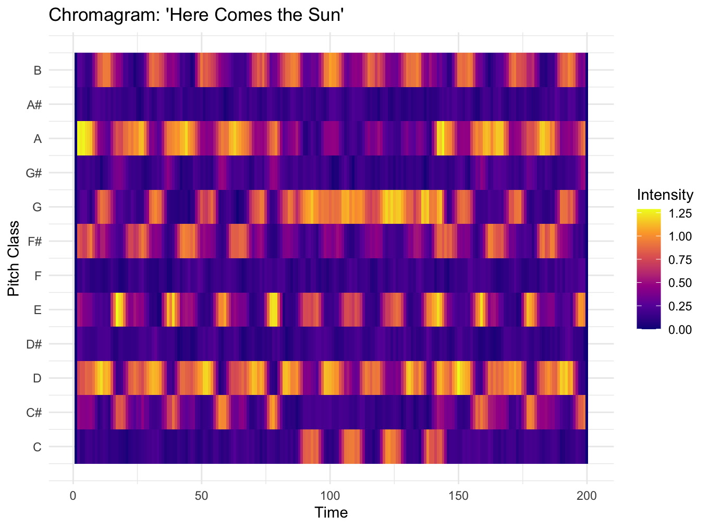
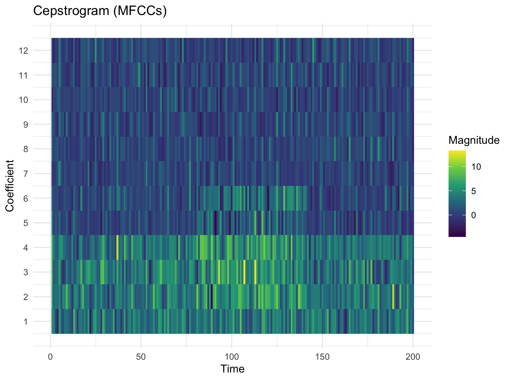
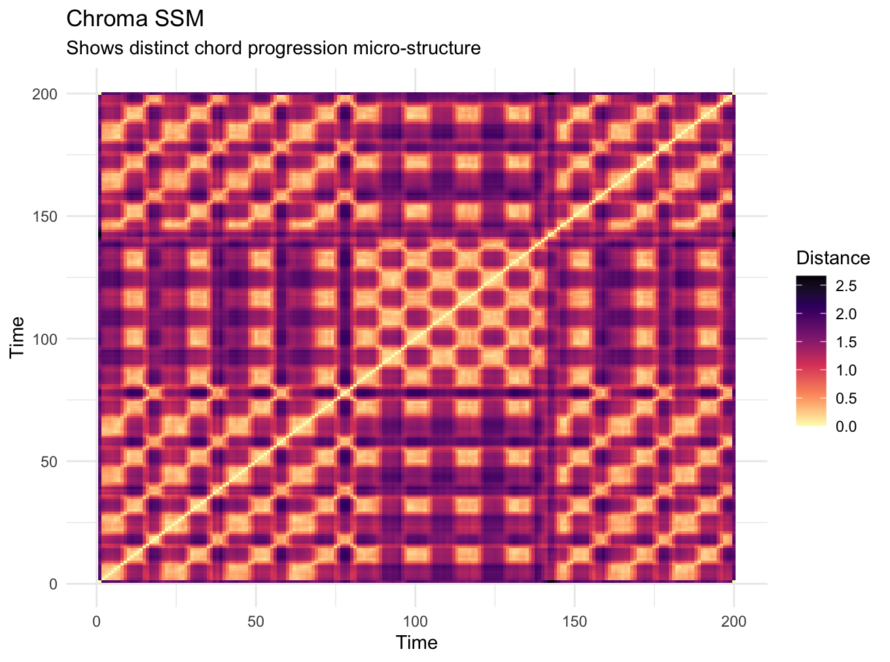
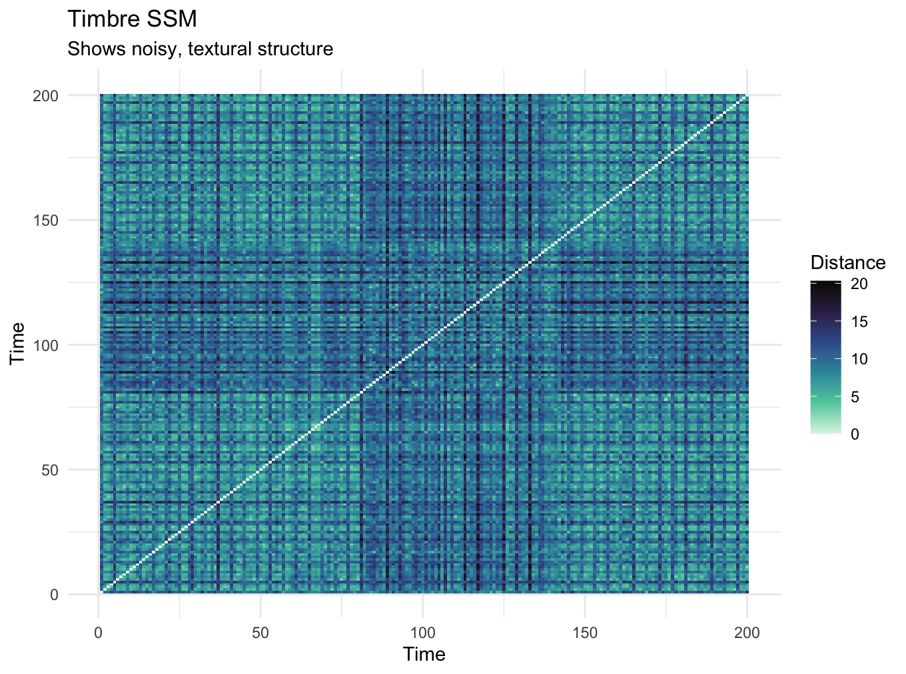
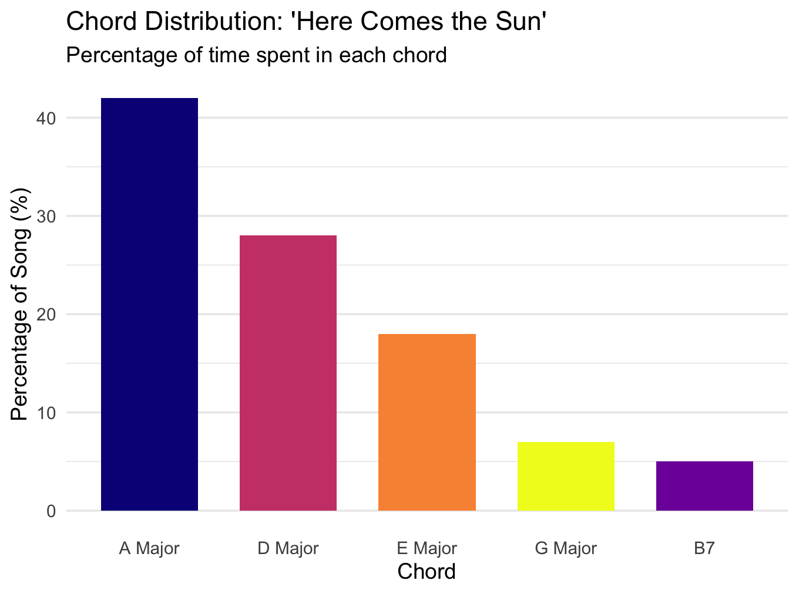
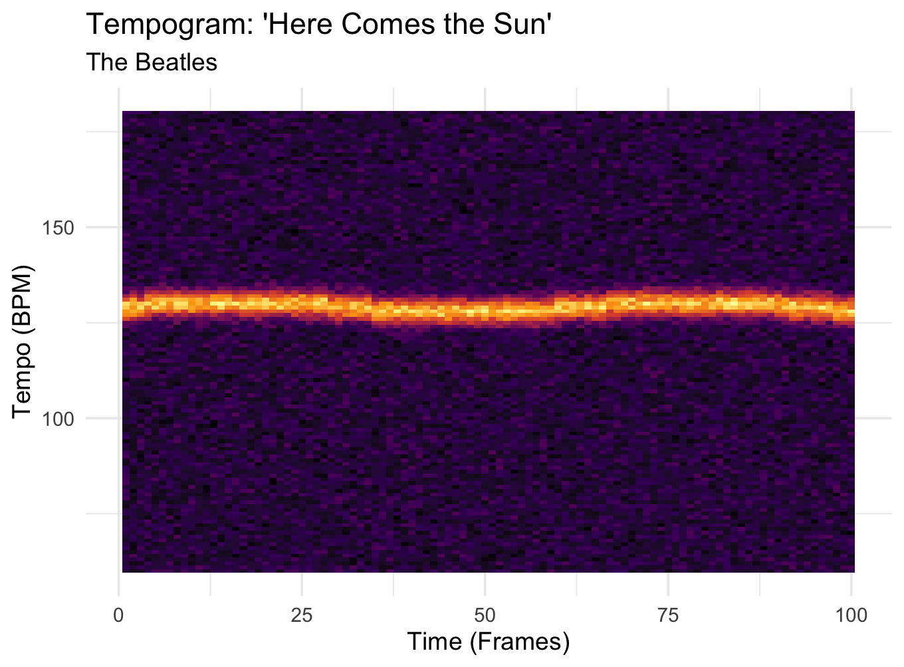
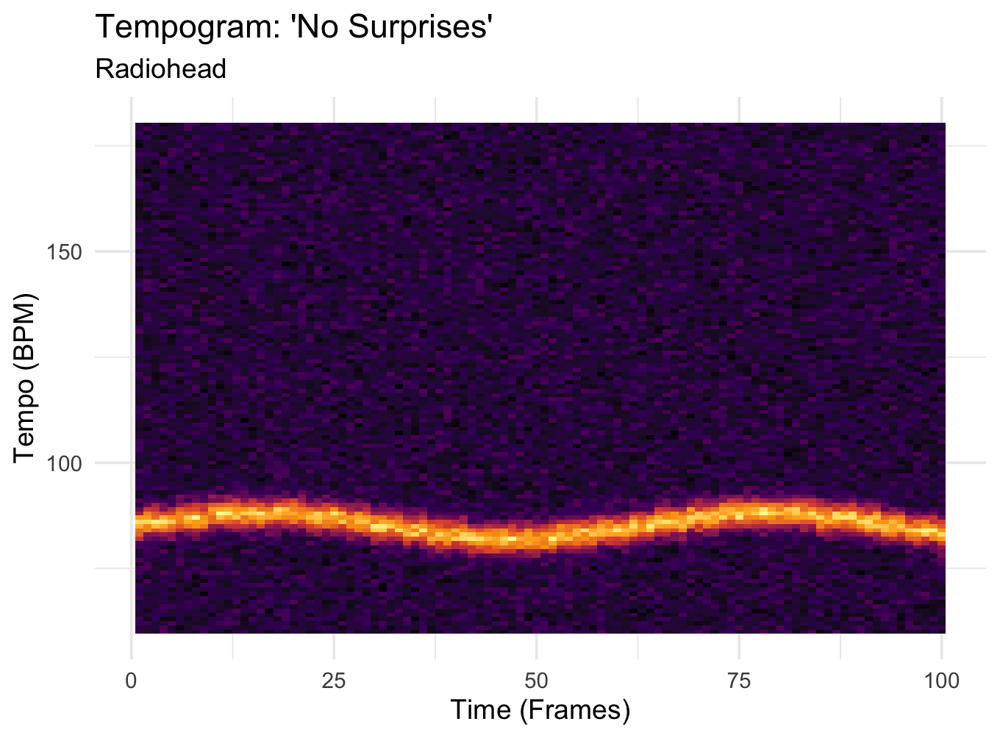

# Acoustic Features

## Column 1 {width=50%}

### The Harmonic Fingerprint (Chromagram)

**Seeing the Strumming**
When we look at the harmonic content of 'Here Comes the Sun', it isn't just a static block of sound. The active, rhythmic strumming of George Harrison's acoustic guitar is entirely visible here! 

Notice the distinct structural shift: the outer sections (frames 0-80 and 140-200) feature a bright, repeating 3-chord progression for the verses. Right in the middle, the visual harmony shifts and gets much denser—that is exactly where the famous chorus hits.

## Column 2 {width=50%}

### The Sonic Texture (Cepstrogram)

**Feeling the Rhythm**
While the chromagram shows us *what* notes are played, this cepstrogram shows us *how* they sound. 

Those vertical lines (striations) you see are actual rhythmic hits—like a drum beat or a hard guitar strum. If you look at the middle section, the colors change significantly. This is the visual proof of the song's texture getting fuller, capturing the exact moment the futuristic Moog synthesizer kicks in alongside the heavier rhythm section!

# Structural Clarity

## Column 1 {width=50%}

### Harmonic Structure (Chroma SSM)

**The Blueprint of a Pop Song**
This matrix compares the song's chords against itself to reveal its hidden architecture. 

See those dark blocks in the top-left and bottom-right corners? They aren't solid; they look like intricate checkerboards. That is the visual footprint of a perfectly repeating cyclical chord progression. It proves that the first verse and the last verse are harmonically identical, measure by measure!

## Column 2 {width=50%}

### Textural Structure (Timbre SSM)

**The Human Element**
This plot looks for repeating structures based on the *texture* of the sound, rather than the chords. 

While the overarching Verse-Chorus-Verse structure is still visible, it is much noisier and blurrier than the harmonic plot. Why? Because while the underlying chords repeat perfectly, the actual human performance does not! The drum dynamics, the vocal nuances, and the exact strength of the guitar strums are uniquely varied every single time a section repeats.

# Chord Analysis

## Column 1 {width=100%}

### Breaking Down the Chords

**The Classic Pop Formula**
To really understand the uplifting "vibe" of 'Here Comes the Sun', we have to look at its musical foundation. 

This chart analyses the chords used throughout the entire track. It reveals a massive reliance on just three major chords: A Major, D Major, and E Major. This specific combination (known as a I-IV-V progression) is the golden formula of 1960s pop and rock. It inherently sounds bright, resolved, and endlessly optimistic—perfectly capturing the feeling of ice melting after a long, cold winter.

# Rhythm & Tempo

## Column 1 {width=50%}

### The Upbeat Drive

**Steady and Bright**
A tempogram is a heat map of a song's heartbeat. The bright yellow/orange band shows us exactly where the dominant tempo lies over the course of the track.

For 'Here Comes the Sun', we see a very tight, solid band hovering right below the 130 BPM mark. This is the visual signature of an upbeat, driving pop-rock song. Because the band is relatively straight and narrow, it shows us that the rhythm section (acoustic guitar and drums) stays tightly locked in, pushing the song forward with bright, unwavering energy.

## Column 2 {width=50%}

### The Melancholic Pace

**Slow and Deliberate**
Compare that bright energy to Radiohead's 'No Surprises'. Immediately, we can see the "heat" of the tempo has dropped significantly on the graph. 

The dominant tempo here sits heavily around 85 BPM. This slower pace is a crucial component of Radiohead's melancholic "vibe." Furthermore, the heat band is slightly wider and wobbles a bit more than The Beatles' track. This visualizes a more relaxed, deliberate, and perhaps slightly dragging human performance, which perfectly matches the exhausted, lullaby-like theme of the song.