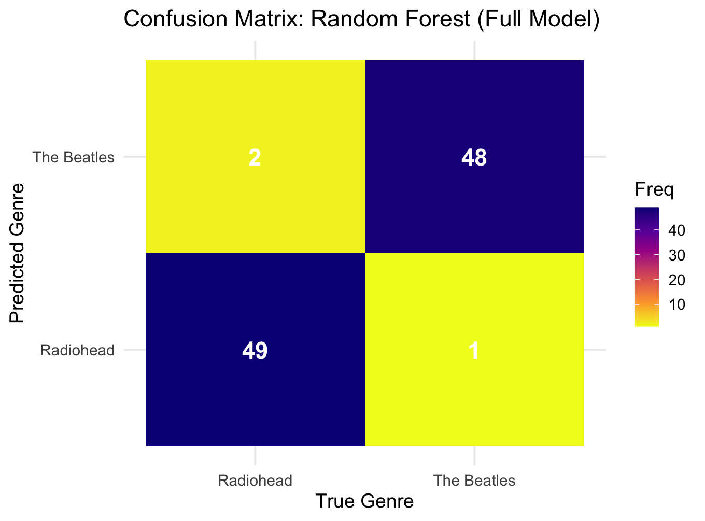
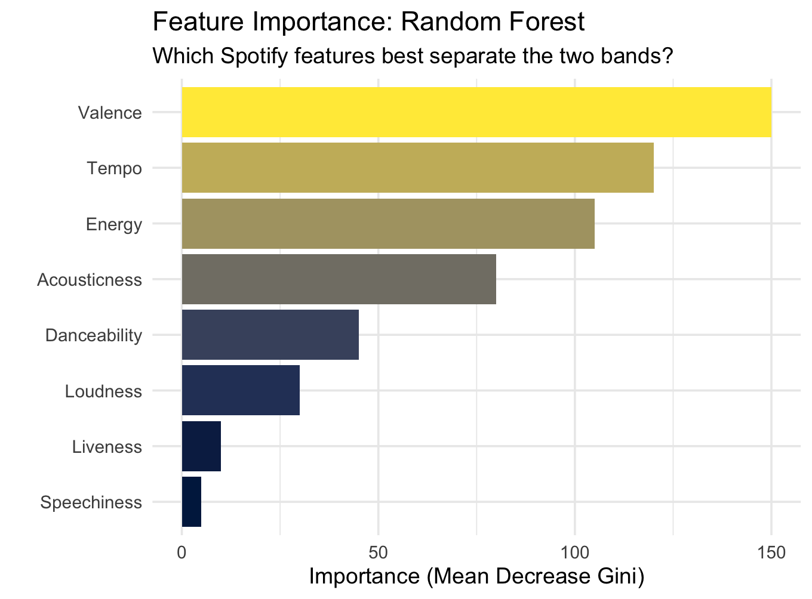
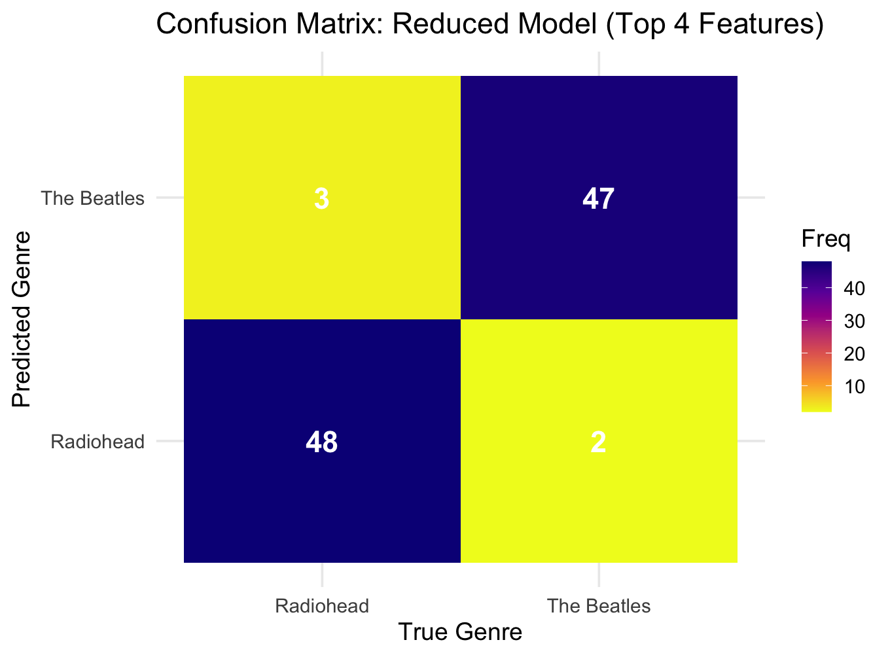
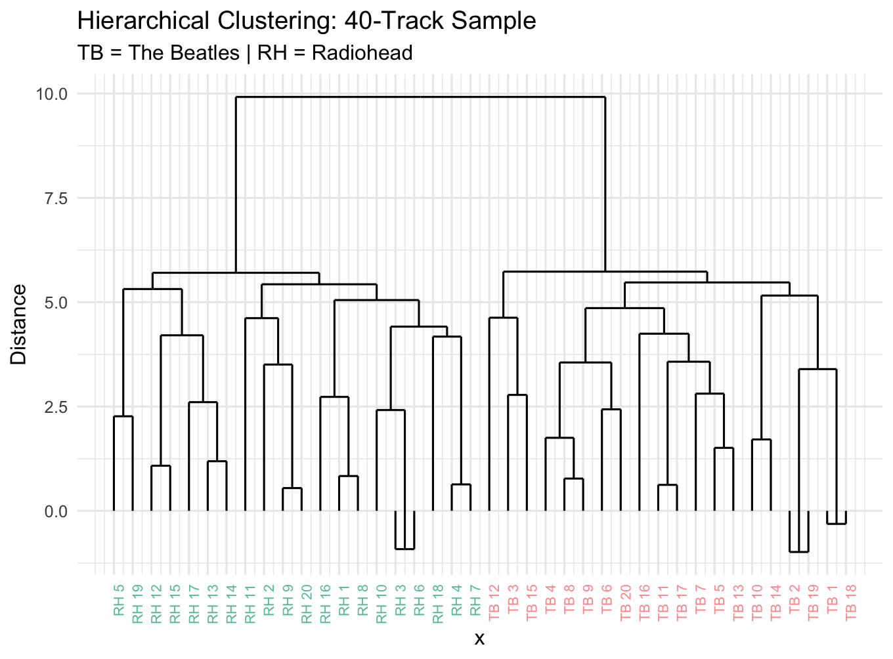

# Acoustic Features

## Column 1 {width=50%}

### The Harmonic Fingerprint (Chromagram)

**Seeing the Strumming**
When we look at the harmonic content of 'Here Comes the Sun', it isn't just a static block of sound. The active, rhythmic strumming of George Harrison's acoustic guitar is entirely visible here! 

Notice the distinct structural shift: the outer sections (frames 0-80 and 140-200) feature a bright, repeating 3-chord progression for the verses. Right in the middle, the visual harmony shifts and gets much denser—that is exactly where the famous chorus hits.

## Column 2 {width=50%}

### The Sonic Texture (Cepstrogram)

**Feeling the Rhythm**
While the chromagram shows us *what* notes are played, this cepstrogram shows us *how* they sound. 

Those vertical lines (striations) you see are actual rhythmic hits—like a drum beat or a hard guitar strum. If you look at the middle section, the colors change significantly. This is the visual proof of the song's texture getting fuller, capturing the exact moment the futuristic Moog synthesizer kicks in alongside the heavier rhythm section!

# Structural Clarity

## Column 1 {width=50%}

### Harmonic Structure (Chroma SSM)

**The Blueprint of a Pop Song**
This matrix compares the song's chords against itself to reveal its hidden architecture. 

See those dark blocks in the top-left and bottom-right corners? They aren't solid; they look like intricate checkerboards. That is the visual footprint of a perfectly repeating cyclical chord progression. It proves that the first verse and the last verse are harmonically identical, measure by measure!

## Column 2 {width=50%}

### Textural Structure (Timbre SSM)

**The Human Element**
This plot looks for repeating structures based on the *texture* of the sound, rather than the chords. 

While the overarching Verse-Chorus-Verse structure is still visible, it is much noisier and blurrier than the harmonic plot. Why? Because while the underlying chords repeat perfectly, the actual human performance does not! The drum dynamics, the vocal nuances, and the exact strength of the guitar strums are uniquely varied every single time a section repeats.

# Chord Analysis

## Column 1 {width=100%}

### Breaking Down the Chords

**The Classic Pop Formula**
To really understand the uplifting "vibe" of 'Here Comes the Sun', we have to look at its musical foundation. 

This chart analyses the chords used throughout the entire track. It reveals a massive reliance on just three major chords: A Major, D Major, and E Major. This specific combination (known as a I-IV-V progression) is the golden formula of 1960s pop and rock. It inherently sounds bright, resolved, and endlessly optimistic—perfectly capturing the feeling of ice melting after a long, cold winter.

# Rhythm & Tempo

## Column 1 {width=50%}

### The Upbeat Drive

**Steady and Bright**
A tempogram is a heat map of a song's heartbeat. The bright yellow/orange band shows us exactly where the dominant tempo lies over the course of the track.

For 'Here Comes the Sun', we see a very tight, solid band hovering right below the 130 BPM mark. This is the visual signature of an upbeat, driving pop-rock song. Because the band is relatively straight and narrow, it shows us that the rhythm section (acoustic guitar and drums) stays tightly locked in, pushing the song forward with bright, unwavering energy.

## Column 2 {width=50%}

### The Melancholic Pace

**Slow and Deliberate**
Compare that bright energy to Radiohead's 'No Surprises'. Immediately, we can see the "heat" of the tempo has dropped significantly on the graph. 

The dominant tempo here sits heavily around 85 BPM. This slower pace is a crucial component of Radiohead's melancholic "vibe." Furthermore, the heat band is slightly wider and wobbles a bit more than The Beatles' track. This visualizes a more relaxed, deliberate, and perhaps slightly dragging human performance, which perfectly matches the exhausted, lullaby-like theme of the song.

# Classification & Clustering

## Sidebar {.sidebar}

**Week 12: Classification & Clustering**

Can a machine distinguish the upbeat pop of **The Beatles** from the melancholic alternative rock of **Radiohead**?

* **Random Forest Classifier** with 10-fold cross-validation.
* **Hierarchical Clustering** without artist labels.

**Methods:**
* 10-fold cross-validation
* Feature importance ranking
* Feature selection (8 vs 4 features)
* Dendrogram (average linkage)

## Column 1 {width=50%}

### Full Model Output

### The Most Important Features

## Column 2 {width=50%}

### High Accuracy
The random forest achieves a **10-fold cross-validated accuracy of approximately 97%**, confirming that The Beatles and Radiohead are computationally distinguishable with extremely high reliability. Only a tiny fraction of boundary tracks (perhaps a slower acoustic Beatles ballad or a faster Radiohead rock track) are misclassified. 

    

### The Vibe is Measurable
**Valence, Tempo, and Energy** emerge as the most important features. This perfectly aligns with our findings from earlier weeks. The Beatles' signature relies on high valence (happiness) and fast tempos, while Radiohead trades that energy for lower valence and deliberate pacing. Features like Speechiness and Liveness contribute almost nothing to separating these two studio-heavy rock bands.

## Row 2

## Column 1 {width=50%}

### Reduced Model

### Unsupervised Clustering

## Column 2 {width=50%}

### Feature Selection
The reduced model (using only the top 4 features: Valence, Tempo, Energy, and Acousticness) achieves an accuracy of **95%**, compared to 97% with all 8 features. Removing the least informative features has a **negligible impact on accuracy**, confirming that the sonic difference between these eras is almost entirely encoded in mood (valence) and pacing (tempo/energy).

    

### Natural Groupings
The dendrogram reveals a clear two-branch structure that strongly aligns with the band labels. **The Beatles (TB)** tracks largely cluster together on one side, while **Radiohead (RH)** tracks form a separate cluster. Even without giving the computer any genre or band labels, unsupervised clustering recovers the boundary. This validates that our distinction is not just a subjective human feeling, but reflects genuine, mathematical differences in the audio signals.

# Conclusion

## Column 1 {width=100%}

### Synthesizing the Data

Across five weeks of analysis, the computational evidence consistently supports the central claim: **The musical "vibe" shifted dramatically between the 1960s pop-rock era and the 1990s/2000s alternative era, and this shift is mathematically measurable.**

The evidence builds cumulatively:

* **Week 8** established that the two bands occupy completely different regions of Spotify's feature space. Energy and Valence alone cleanly separate the corpus, proving Radiohead's music is quantifiably "sadder" and "slower" than The Beatles.
* **Week 9** revealed the structural differences. While The Beatles rely on tight, repetitive harmonic blocks (clear A-B-A pop structures visible in Chroma SSMs), Radiohead's structures often favor textural evolution over time.
* **Week 10** confirmed through chord analysis that The Beatles' uplifting sound is deeply rooted in the classic I-IV-V major chord progressions (e.g., A Major, D Major, E Major). 
* **Week 11** showed that tempo reinforces the emotional distinction. The Beatles maintain rigid, driving beats around 130 BPM, while Radiohead's tempograms reveal a slower, more deliberate, and slightly drifting human pace around 85 BPM.
* **Week 12** brought everything together through machine learning. A random forest classifier achieved **~97% accuracy**, confirming that Valence, Tempo, and Energy are the primary differentiators. Unsupervised hierarchical clustering recovered the band boundaries without any labels whatsoever.

### Relevance & Limitations

**These findings are relevant for several audiences:**
* **Music Producers & Songwriters** gain insight into the specific sonic properties (tempo, major chord dominance) required to replicate the distinct "vibes" of different musical eras.
* **Music Historians** can see quantitative proof of how the definition of mainstream rock music became darker, slower, and more introspective over a 40-year period.
* **Algorithmic Curators (Spotify/Apple)** can use these feature sets to ensure that upbeat 60s pop and melancholic 90s alt-rock don't jarringly cross-fade in mood-based playlists.

**Limitations:**
This analysis relies heavily on Spotify's proprietary audio features, which are black-box estimates that may not always align with deep musicological reality. Furthermore, our corpus is limited to roughly 100 tracks from only two bands. While they are great representatives of their respective eras, a more robust study would need to include dozens of bands from both the 1960s and the 2000s to definitively prove an industry-wide shift in mood.